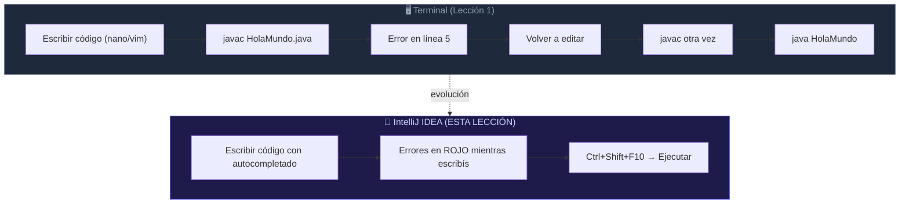
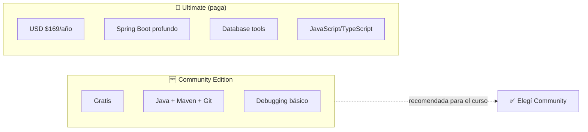
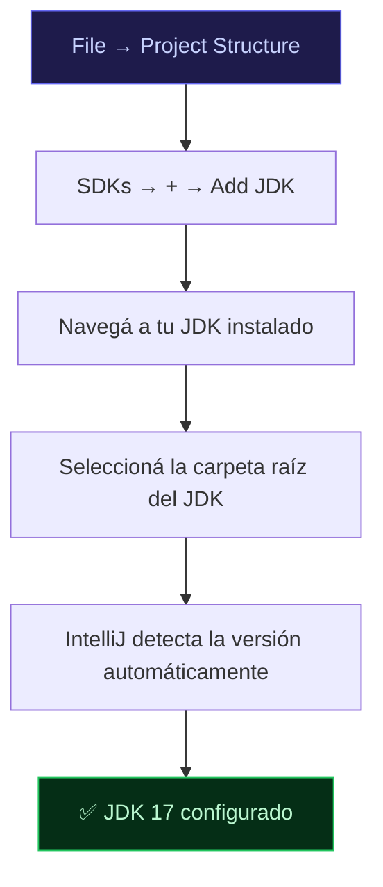
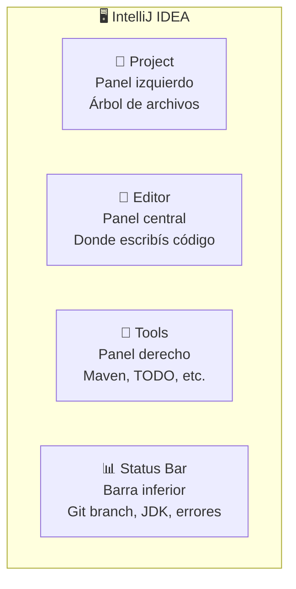
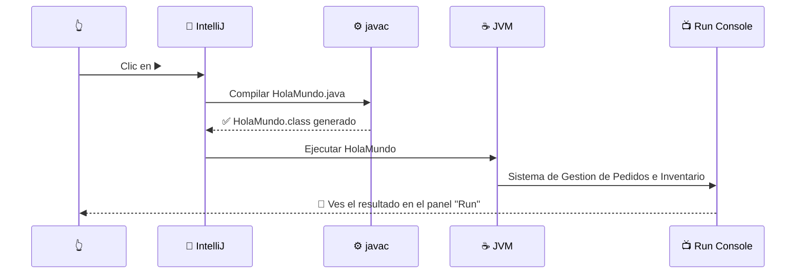
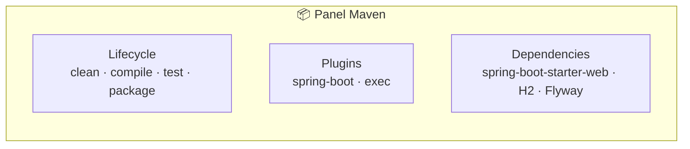
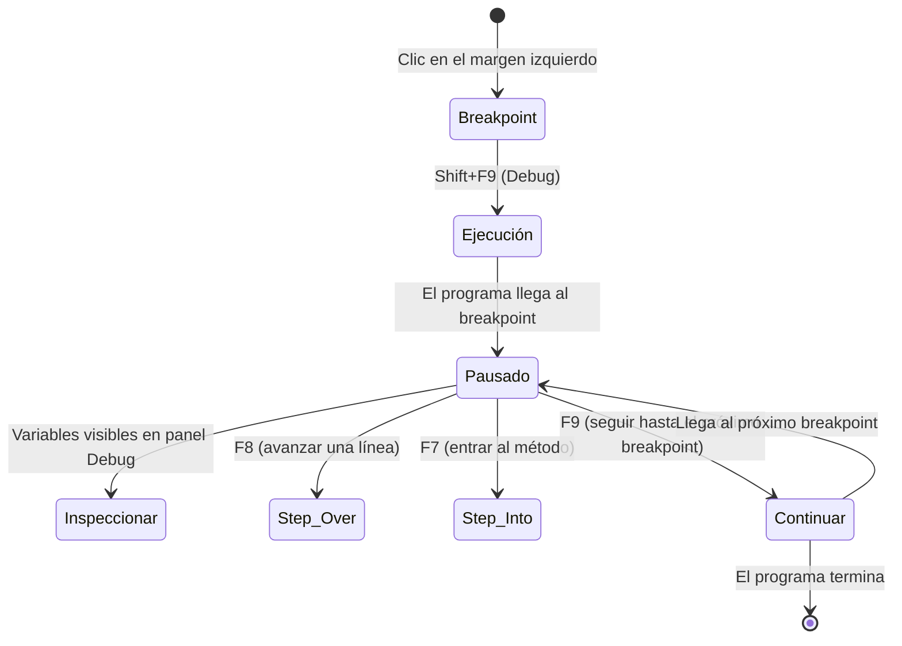

import Reveal from '../../../components/Reveal.astro';
import Quiz from '../../../components/Quiz.astro';
import SelfCheck from '../../../components/SelfCheck.astro';
import ErrorChallenge from '../../../components/ErrorChallenge.astro';
import Comparativa from '../../../components/Comparativa.astro';

## Qué vas a aprender

Después de esta lección vas a tener IntelliJ IDEA instalado y configurado para trabajar con el proyecto del curso. Vas a poder ejecutar código con un clic, depurar con breakpoints, y aprovechar los atajos de teclado que hacen que un desarrollador Java profesional sea 10 veces más rápido que alguien que solo usa la terminal.

[](https://www.jetbrains.com/idea/)

## Por qué necesitas aprenderlo

Compilar con `javac` y ejecutar con `java` desde la terminal (Lección 1) te enseñó qué pasa POR DENTRO. Ahora necesitás una herramienta que te dé velocidad: autocompletado inteligente, refactoring automático, navegación entre clases, depuración visual, y ejecución con un solo botón. IntelliJ IDEA es el estándar de la industria Java — lo usan desde startups hasta bancos.

## Qué debes saber antes

El flujo `javac → .class → JVM` de la Lección 1. No necesitás saber nada más.

## Recupera lo aprendido

¿Por qué `javac` y `java` son dos comandos separados, y no uno solo?

<Reveal titulo="Respuesta">
Porque Java separa la COMPILACIÓN (código fuente → bytecode, `javac`) de la EJECUCIÓN (bytecode → resultado, `java`). Esto permite compilar UNA vez y ejecutar el mismo `.class` en cualquier sistema operativo con JVM, sin recompilar.
</Reveal>

## Problema

Ya sabés compilar y ejecutar desde la terminal. Pero editar código en un bloc de notas o nano, guardar, ir a la terminal, compilar, ver errores, volver a editar... es lento. Muy lento. Cuando tengas 27 archivos Java como el proyecto final de este curso, recordar en qué archivo está cada clase y compilar todo a mano se vuelve imposible.

## Modelo mental



## Explicación sencilla

IntelliJ IDEA es un editor de código CON CEREBRO. No solo te muestra el texto — lo ENTIENDE. Sabe que `Product` es una clase, que `getNombre()` es un método, y que si intentás llamar a un método que no existe, te lo marca en rojo ANTES de compilar. Es como pasar de una calculadora básica a una computadora: ambas hacen cuentas, pero una lo hace en milisegundos con validación automática.

## Explicación técnica

IntelliJ IDEA construye un **índice** de todo tu proyecto: analiza cada archivo `.java`, resuelve imports, entiende la jerarquía de clases, y mantiene un modelo interno del código. Esto le permite:

- **Autocompletado inteligente**: cuando escribís `producto.`, te sugiere SOLO los métodos que existen en `Product`.
- **Análisis estático en tiempo real**: errores de compilación, warnings, y sugerencias de mejora aparecen MIENTRAS escribís, sin necesidad de compilar.
- **Refactoring automático**: renombrar una clase o método en 50 archivos es un solo comando. IntelliJ actualiza TODAS las referencias automáticamente.
- **Depuración visual**: podés pausar la ejecución en cualquier línea, inspeccionar variables, y avanzar paso a paso viendo el estado del programa.

IntelliJ NO reemplaza a `javac` ni a `java` — los USA internamente. Cuando hacés "Run", IntelliJ ejecuta `javac` y `java` por vos, mostrando el resultado integrado en el IDE. El compilador es el mismo; la herramienta que lo invoca es distinta.

## Cómo funciona — Instalación paso a paso

### Paso 1: Descargar IntelliJ IDEA

Andá a [jetbrains.com/idea/download](https://www.jetbrains.com/idea/download/). Vas a ver dos versiones:



**Elegí Community Edition** (la de la izquierda, gratuita). Tiene TODO lo que necesitás para este curso: Java, Maven, Git, depuración, y ejecución de tests. La Ultimate agrega soporte profundo de Spring Boot y bases de datos, pero no es necesaria para aprender.

### Paso 2: Instalar

**Windows**: ejecutá el `.exe`, siguiente-siguiente, marcá "Add to PATH" y "Create Desktop Shortcut".

**macOS**: arrastrá el `.dmg` a Applications.

**Linux**: descomprimí el `.tar.gz` en `/opt/` y ejecutá `bin/idea.sh`. También podés instalarlo vía snap: `sudo snap install intellij-idea-community --classic`.

### Paso 3: Primer lanzamiento

Al abrir IntelliJ por primera vez:

1. **"Import Settings"** → Elegí "Do not import settings" (es tu primera vez).
2. **"Choose UI Theme"** → Elegí **Darcula** (oscuro, recomendado para programar de noche) o **IntelliJ Light**.
3. **"Create Launcher Script"** → Marcá "Add launcher dir to PATH" (para poder abrir IntelliJ desde la terminal con `idea .`).
4. **"Default Plugins"** → Dejá los que vienen marcados. Después vas a instalar más.

### Paso 4: Configurar el JDK



IntelliJ necesita saber DÓNDE está tu JDK. Normalmente lo detecta solo. Si no:

- **Windows**: `C:\Program Files\Java\jdk-17`
- **macOS**: `/Library/Java/JavaVirtualMachines/jdk-17.jdk`
- **Linux**: `/usr/lib/jvm/java-17-openjdk`

Verificá que la versión sea 17 o superior. Este curso usa Java 17.

### Paso 5: Abrir el proyecto del curso


En la pantalla de bienvenida, hacé clic en **Open** (no "New Project") y navegá hasta la carpeta `cursodejava/proyecto-maven/`. IntelliJ va a detectar automáticamente:

- El `pom.xml` de Maven
- Las dependencias de Spring Boot
- La estructura de paquetes Java

La primera vez que abras el proyecto, IntelliJ va a **indexar** todos los archivos. En la barra de estado inferior vas a ver "Indexing..." — esperá a que termine (30 segundos a 1 minuto) antes de empezar a trabajar. Mientras indexa, el autocompletado no funciona al 100%.

## Tour visual de la interfaz


*Captura oficial de JetBrains — IntelliJ IDEA 2025.1 con tema oscuro Darcula.*



| Zona | ¿Qué hay? | ¿Para qué sirve? |
|------|-----------|-----------------|
| **Project** (izquierda, `Alt+1`) | Árbol de carpetas y archivos | Navegar entre clases, crear nuevos archivos |
| **Editor** (centro) | El código fuente | Esribir, leer, modificar código |
| **Tools** (derecha, `Alt+7`) | Estructura de la clase actual | Ver métodos y atributos de un vistazo |
| **Status Bar** (abajo) | Rama Git, encoding, posición del cursor | Información rápida del estado del proyecto |

[🖼️ Ver más screenshots oficiales en jetbrains.com/idea](https://www.jetbrains.com/idea/)

## Ejecutar HolaMundo desde IntelliJ

### La primera ejecución

1. En el panel **Project** (`Alt+1`), navegá hasta `HolaMundo.java`.
2. Hacé clic en el **triángulo verde ▶️** que aparece a la izquierda del `main`:

```
▶️ public static void main(String[] args) {
```

3. Elegí **"Run 'HolaMundo.main()'"**.

### ¿Qué pasó?



IntelliJ ejecutó `javac` y `java` por vos, y mostró el resultado en el panel **Run** (abajo). Es EXACTAMENTE lo mismo que hiciste en la terminal en la Lección 1 — solo que ahora es un clic en vez de dos comandos.

Ahora, cada vez que quieras ejecutar ese programa de nuevo, apretá `Shift+F10` (o el botón verde ▶️ en la barra superior).

## Atajos de teclado esenciales

Estos 10 atajos son los que usan los desarrolladores profesionales TODO EL TIEMPO. Aprendelos de memoria.

| Atajo | ¿Qué hace? | ¿Cuándo usarlo? |
|-------|-----------|----------------|
| `Shift+F10` | Ejecutar el programa actual | Cada vez que querés correr tu código |
| `Shift+F9` | Depurar (Debug) | Cuando necesitás inspeccionar variables paso a paso |
| `Ctrl+Shift+F10` | Ejecutar la clase actual | Si el foco está en el editor, no en el panel de proyecto |
| `Ctrl+D` | Duplicar línea | Copiar una línea sin Ctrl+C Ctrl+V |
| `Ctrl+Y` | Eliminar línea | Borrar una línea entera sin seleccionarla |
| `Ctrl+Shift+Flechas` | Mover línea arriba/abajo | Reordenar código |
| `Alt+1` | Abrir/Cerrar panel Project | Navegar entre archivos |
| `Ctrl+N` | Buscar clase por nombre | "¿Dónde está `ProductoController`?" |
| `Ctrl+Shift+N` | Buscar archivo por nombre | "¿Dónde está `application.properties`?" |
| `Alt+Enter` | Mostrar intenciones (el "arreglame esto") | Sobre cualquier error o warning en rojo/amarillo |

**Tip profesional**: `Alt+Enter` es el atajo MÁS importante. Parate sobre cualquier cosa que esté subrayada en rojo o amarillo, apretá `Alt+Enter`, e IntelliJ te va a sugerir cómo arreglarlo. En muchos casos, puede arreglarlo automáticamente.

## El proyecto Maven en IntelliJ

Cuando abrís `proyecto-maven/`, IntelliJ reconoce el `pom.xml` y aparece un panel **Maven** a la derecha:



Hacé doble clic en cualquier goal de Maven para ejecutarlo:

- **compile**: compila todo el proyecto (equivalente a `./mvnw compile`)
- **test**: ejecuta todos los tests (`./mvnw test`)
- **spring-boot:run**: levanta la aplicación (`./mvnw spring-boot:run`)

El resultado aparece en el panel **Run** (abajo), igual que con `HolaMundo`.

## Depuración (Debug) — tu superpoder

Depurar es ejecutar el programa en "cámara lenta" para ver EXACTAMENTE qué está pasando.



### Cómo depurar HolaMundo

1. Hacé clic en el **margen izquierdo** (al lado del número de línea) sobre `System.out.println(...)`. Aparece un **círculo rojo** 🔴 — eso es un **breakpoint**.
2. Ejecutá con **Debug**: clic en el ícono de bichito 🐞 o `Shift+F9`.
3. El programa se **pausa** en esa línea. En el panel **Debug** (abajo) vas a ver:
   - **Frames**: la pila de llamadas (acá solo `main`)
   - **Variables**: `args` (el array de argumentos)
4. Apretá `F8` (Step Over) para ejecutar esa línea y avanzar a la siguiente.
5. Apretá `F9` (Resume) para que el programa siga hasta el final.

En programas más complejos (como `ServicioVentas` en la Etapa 10), la depuración es la única forma práctica de entender por qué una variable tiene un valor incorrecto o por qué una excepción se lanza en un momento inesperado.

## Plugins recomendados

IntelliJ tiene un ecosistema de plugins. Estos 4 son esenciales para el curso:

| Plugin | ¿Para qué? | Cómo instalarlo |
|--------|-----------|----------------|
| **Lombok** | `@Data`, `@Builder`, `@Slf4j` (no los usamos en el curso, pero aparece en proyectos reales) | File → Settings → Plugins → Marketplace |
| **Maven Helper** | Analiza conflictos de dependencias en el `pom.xml` | Ídem |
| **Rainbow Brackets** | Colorea pares de `{}`, `()`, `[]` para que no te pierdas | Ídem |
| **Key Promoter X** | Te muestra el atajo de teclado cada vez que usás el mouse | Ídem — ideal mientras aprendés los atajos |

Para instalar cualquiera: `File → Settings → Plugins → Marketplace → Buscar → Install → Reiniciar`.

## Configuración recomendada

### Formateo automático al guardar

Para que tu código siempre esté prolijo sin pensar en eso:

1. `File → Settings → Tools → Actions on Save`
2. Marcá **"Reformat code"** y **"Optimize imports"**
3. `OK`

Cada vez que guardes (`Ctrl+S`), IntelliJ va a ordenar los imports y formatear el código automáticamente.

### Fuente para programar

`File → Settings → Editor → Font`:

- **Font**: JetBrains Mono (viene con IntelliJ, es la mejor fuente para código)
- **Size**: 14 (o lo que te resulte cómodo)
- **Line height**: 1.4
- **Enable ligatures**: ✅ (combina `->` en una flecha real `→`)

### Tema de colores para Java

`File → Settings → Editor → Color Scheme → Java`. Elegí el esquema que ya tengas (Darcula es excelente para Java). IntelliJ colorea clases, métodos, variables y strings con colores distintos — esto no es decoración: es información visual que te ayuda a leer código más rápido.

## Ejemplo aplicado al proyecto

A partir de AHORA, todas las lecciones del curso asumen que trabajás con IntelliJ IDEA. Cuando una lección diga "ejecutá el programa", vas a usar `Shift+F10`. Cuando diga "poné un breakpoint", vas a usar `Shift+F9`. La terminal (`javac`/`java` manual) te sirvió para ENTENDER el proceso — IntelliJ te sirve para ser PRODUCTIVO.

Ya NO necesitás compilar manualmente con `javac`. IntelliJ lo hace por vos cada vez que ejecutás. Ya NO necesitás buscar en qué archivo está una clase — `Ctrl+N` la encuentra en milisegundos.

## Error común

<ErrorChallenge
  sintoma="IntelliJ marca TODO en rojo apenas abrís el proyecto, incluso clases que sabés que compilan."
  diagnostico="En el panel Project, los archivos .java tienen un ícono de círculo rojo, y el Editor muestra errores en todas partes."
  causa="IntelliJ todavia esta INDEXANDO el proyecto, o el JDK no esta configurado (Project Structure → SDK esta vacio)."
  solucion="Espera a que termine 'Indexing...' en la barra de estado inferior (30s-1min). Si el problema persiste, File → Project Structure → Project → SDK → seleccionar JDK 17."
  prevencion="Al abrir un proyecto por primera vez, siempre esperar a que termine la indexacion. La barra de estado dice 'Indexing...' mientras trabaja — no hagas nada hasta que desaparezca."
>
```
// IntelliJ subraya en rojo aunque el código es correcto:
public class HolaMundo {
    public static void main(String[] args) {
        System.out.println("Hola"); // ⚠️ rojo pero compila bien
    }
}
```
</ErrorChallenge>

## Ejercicio trabajado

Configurar el formateo automático y verificarlo:

1. Escribí una clase con imports desordenados y llaves mal indentadas.
2. Guardá (`Ctrl+S`) con "Reformat code" activado.
3. Confirmá que los imports se ordenaron y las llaves se alinearon.

```java
// ANTES de guardar:
import java.util.List;
import java.io.File;
public class Desordenado {public static void main(String[]args){
System.out.println("desprolijo");}}

// DESPUÉS de guardar (automático):
import java.io.File;
import java.util.List;

public class Desordenado {
    public static void main(String[] args) {
        System.out.println("desprolijo");
    }
}
```

## Ejercicio guiado

Creá una nueva clase `Saludo` en el proyecto desde IntelliJ (`Alt+1` → clic derecho en el paquete `com.curso.catalogo` → `New → Java Class`), ponele un `main`, y ejecutala con `Ctrl+Shift+F10`.

<Reveal titulo="Pista 1">
El nombre de la clase debe ser exactamente `Saludo` (mayúscula inicial, sin tilde).
</Reveal>

<Reveal titulo="Pista 2">
Escribí `main` y apretá `Tab` — IntelliJ genera el esqueleto completo del método automáticamente (live template).
</Reveal>

<Reveal titulo="Solución">
```java
package com.curso.catalogo;

public class Saludo {
    public static void main(String[] args) {
        System.out.println("¡Hola desde IntelliJ!");
    }
}
```
</Reveal>

## Ejercicio independiente

Poné un breakpoint en la línea `System.out.println("Sistema de Gestion...")` de `HolaMundo.java`, ejecutá en modo Debug (`Shift+F9`), inspeccioná el array `args` en el panel de Variables, y confirmá que está vacío (length = 0). Después, configurá un argumento de programa (en el panel Run, "Edit Configurations" → "Program arguments") y volvé a depurar para ver cómo `args` ahora contiene ese argumento.

## Transferencia

El Maven de IntelliJ ejecuta EXACTAMENTE los mismos comandos que `./mvnw` desde la terminal. Cuando el curso te pida `./mvnw test`, vas a poder hacerlo desde el panel Maven con doble clic en `test`, o desde la terminal integrada de IntelliJ (`Alt+F12`). Lo mismo para `./mvnw spring-boot:run`. IntelliJ no reemplaza a Maven — solo le da una interfaz gráfica.

## Comprueba que entendiste

<Quiz
  pregunta="¿Qué hace exactamente IntelliJ cuando apretás el botón Run (▶️) en una clase Java con main?"
  opciones={[
    { texto: "Interpreta el código Java directamente, sin compilar", correcta: false, feedback: "No — IntelliJ no interpreta código Java. Ejecuta javac para compilar y luego java para ejecutar." },
    { texto: "Ejecuta javac (compilar) y luego java (ejecutar) automáticamente, mostrando el resultado en el panel Run", correcta: true, feedback: "Correcto: IntelliJ NO reemplaza a javac ni a java — los INVOCA automáticamente. El resultado es el mismo que si lo hicieras manualmente desde la terminal." },
    { texto: "Compila el .java a un .exe nativo de Windows", correcta: false, feedback: "Java no genera .exe nativos — genera bytecode .class, igual que cuando usás javac manual." },
    { texto: "Solo formatea el código, pero no lo ejecuta", correcta: false, feedback: "Run ejecuta el programa de verdad. Formatear es una acción separada (Ctrl+Alt+L o al guardar si lo configuraste)." },
  ]}
/>

## Mini reto de debugging

Configurá un breakpoint en `HolaMundo.java`, ejecutá en Debug, y cuando el programa se pause, usá el panel **Watches** (en la ventana de Debug) para evaluar la expresión `2 + 2` y `System.currentTimeMillis()`. ¿Qué valores devuelven?

<Reveal titulo="Diagnóstico">
`2 + 2` devuelve `4` — podés evaluar cualquier expresión Java válida en tiempo de ejecución. `System.currentTimeMillis()` devuelve el timestamp actual en milisegundos — útil para medir cuánto tarda una sección de código entre dos breakpoints.
</Reveal>

## Mini reto de diseño

¿Por qué IntelliJ construye un "índice" de todo el proyecto al abrirlo, en vez de simplemente abrir los archivos como un editor de texto? ¿Qué ganás con ese tiempo de indexación inicial?

<Comparativa
  columnas={["Herramienta", "¿Entiende Java?", "Compilación", "Ejecución", "Depuración", "Índice del proyecto"]}
  filas={[
    ["Terminal (javac/java)", "❌", "Manual (javac)", "Manual (java)", "No (sin herramientas extra)", "❌"],
    ["Editor de texto (nano, VS Code sin plugins)", "❌", "Manual", "Manual", "No", "❌"],
    ["IntelliJ IDEA Community", "✅", "Automática (Ctrl+Shift+F10)", "Automática (Shift+F10)", "Visual con breakpoints (Shift+F9)", "✅"],
  ]}
/>

## Resumen

- IntelliJ IDEA Community Edition es gratis y cubre todo lo necesario para este curso.
- El flujo de trabajo: abrir proyecto → escribir código → `Shift+F10` (ejecutar) → ver resultado en panel Run.
- `Alt+Enter` es el atajo universal: "IntelliJ, arreglame esto".
- `Ctrl+N` busca clases; `Ctrl+Shift+N` busca archivos.
- Depurar (`Shift+F9`): breakpoint → ejecutar → inspeccionar variables → `F8` avanzar línea.
- IntelliJ ejecuta `javac` y `java` por vos — el compilador es el mismo, la interfaz es distinta.
- Configurá "Reformat code on save" y "Optimize imports on save" para no pensar más en formato.
- El panel Maven permite ejecutar goals (`compile`, `test`, `spring-boot:run`) con doble clic.

## Modelo mental final

Pensá en IntelliJ como un piloto automático para tu avión Java: el avión sigue siendo el mismo (javac + JVM), pero en vez de mover manualmente cada palanca y mirar cada instrumento, el piloto automático lo hace por vos — y además te avisa ANTES de despegar si hay un problema en el motor (errores de compilación en tiempo real).

## Conexión

En la Lección 1 aprendiste QUÉ hacen `javac` y `java`. En esta lección aprendiste a NO TENER QUE USARLOS MANUALMENTE NUNCA MÁS. De ahora en adelante, `Shift+F10`. El resto del curso asume que trabajás con IntelliJ (o cualquier IDE Java, pero IntelliJ es el estándar).

## Próximo paso

Etapa 1: Java Básico — variables, tipos de datos y control de flujo. Vas a escribir código que toma decisiones y repite instrucciones, ejecutándolo todo desde IntelliJ.

## Fuentes

jetbrains.com/idea/documentation — documentación oficial de IntelliJ IDEA. jetbrains.com/idea/resources — atajos de teclado en PDF. dev.java — guías de Java con ejemplos para IntelliJ.

<SelfCheck
  leccionId="etapa-00-como-funciona-java/leccion-02-intellij-idea-setup"
  criterios={[
    "Tengo IntelliJ IDEA Community instalado y funcionando.",
    "Puedo abrir el proyecto del curso y ejecutar HolaMundo con Shift+F10.",
    "Puedo poner un breakpoint, ejecutar en Debug (Shift+F9), e inspeccionar variables.",
    "Conozco los 10 atajos esenciales (Shift+F10, Shift+F9, Alt+Enter, Ctrl+N, Ctrl+Shift+N, Ctrl+D, Ctrl+Y, Alt+1, Ctrl+Shift+F10, Alt+Shift+Flechas).",
    "Puedo ejecutar los tests desde el panel Maven (doble clic en test).",
  ]}
/>
