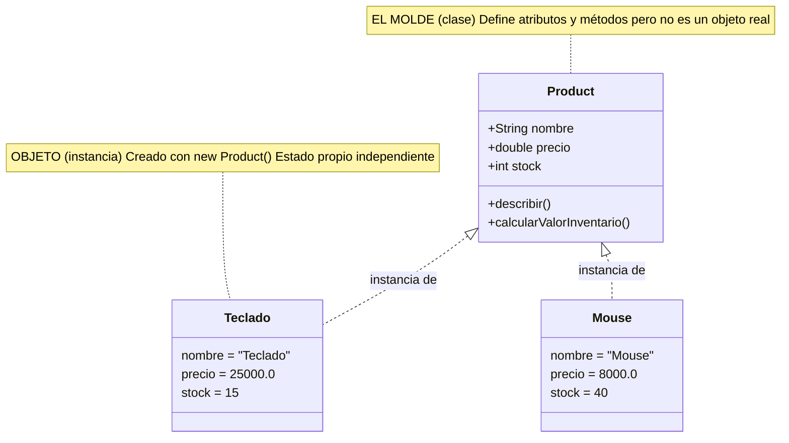
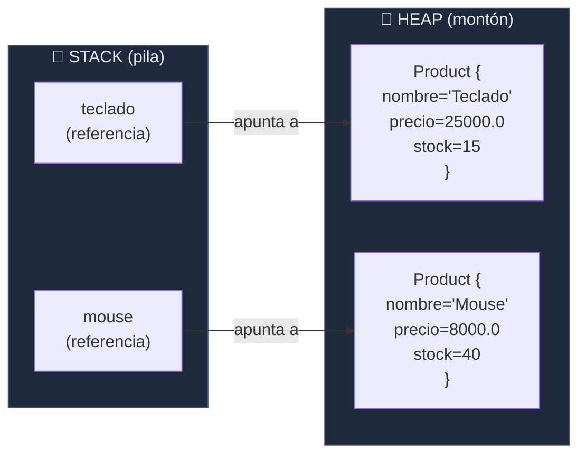
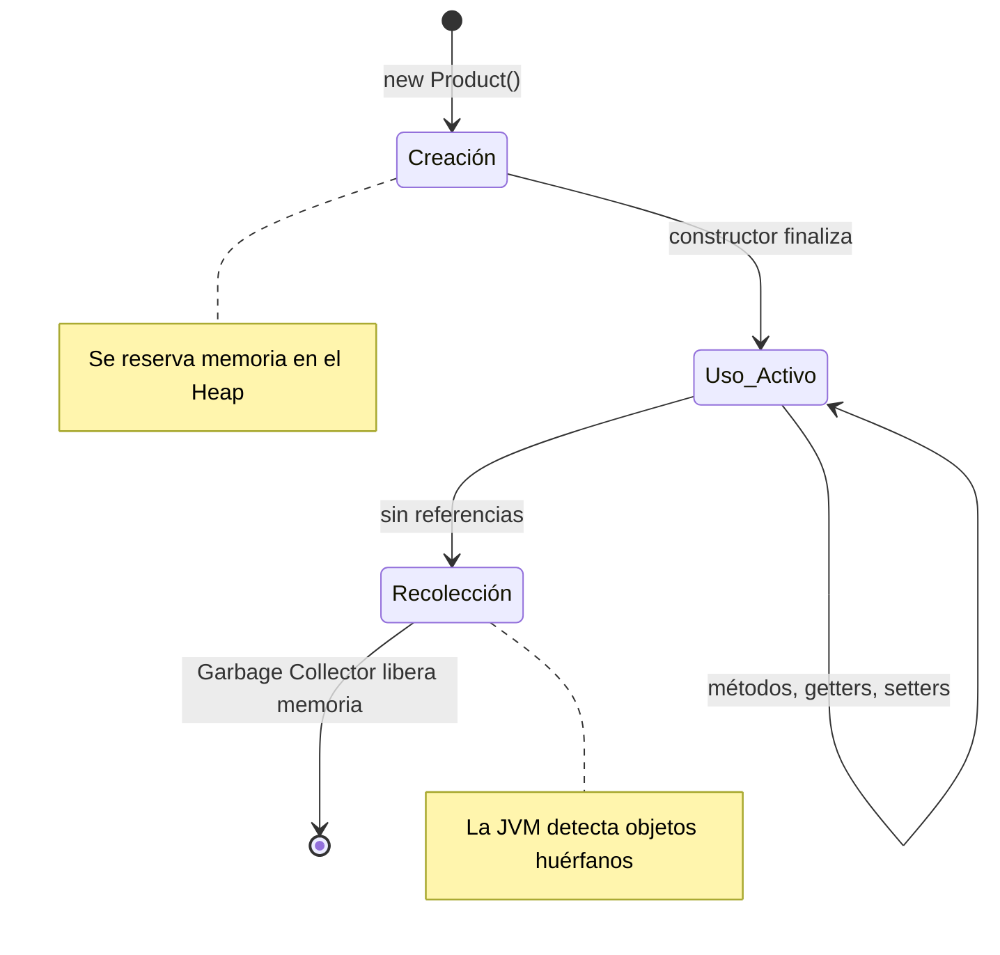

import Reveal from '../../../components/Reveal.astro';
import Quiz from '../../../components/Quiz.astro';
import SelfCheck from '../../../components/SelfCheck.astro';
import ErrorChallenge from '../../../components/ErrorChallenge.astro';
import Comparativa from '../../../components/Comparativa.astro';

## Qué vas a aprender

Después de esta lección serás capaz de definir una clase `Product` con sus propios atributos y métodos, crear varios objetos independientes con `new`, y usar `this` para que un método se refiera al objeto sobre el que fue llamado.

## Por qué necesitas aprenderlo

En toda la Etapa 1, `nombre`, `precio` y `stock` de un producto vivían como variables sueltas. Cada lección lo prometió: acá es donde por fin se agrupan en un objeto real — la base de todo lo que vas a construir en el resto del curso.

## Qué debes saber antes

Tipos primitivos, arrays y métodos (Etapa 1 completa).

## Recupera lo aprendido

Sin mirar la lección anterior: ¿por qué un array tiene tamaño fijo, a diferencia de lo que vas a ver más adelante con `List`?

<Reveal titulo="Respuesta">
Porque un array reserva su espacio de memoria de una sola vez al crearse — no puede crecer ni achicarse después. `List` (Etapa 4) sí puede.
</Reveal>

## Problema

Tenías `nombresProductos` y `stockPorProducto` como dos arrays separados, relacionados solo porque compartían el mismo índice. Si agregás un tercer array `preciosPorProducto`, mantener los tres sincronizados a mano es frágil: nada te impide desalinear un índice sin darte cuenta.

## Modelo mental



## Analogía — La fábrica de galletitas

Imaginá una fábrica de galletitas con un molde de estrella:

- El **MOLDE** (la clase `Product`) define la FORMA: "toda galletita va a tener nombre, precio y stock"
- El molde mismo NO es una galletita — no te lo podés comer
- Cada vez que usás `new`, la máquina APLASTA el molde sobre la masa y sale UNA galletita concreta
- Cada **GALLETITA** (el objeto) es independiente: le podés poner chips a una sin que la otra tenga chips
- Si rompés una galletita, las demás siguen intactas

El molde (`Product`) define LA FORMA. Las galletitas (`teclado`, `mouse`) son las instancias concretas e independientes.

## Explicación sencilla

Una **clase** es un molde: define qué datos tiene un producto (nombre, precio, stock) y qué puede hacer (describirse, calcular su valor). Un **objeto** es cada producto concreto que creás a partir de ese molde — cada uno con sus propios valores, independientes de los demás.

## Explicación técnica

Una clase declara **atributos** (los datos que la conforman — su **estado**) y **métodos** (su **comportamiento**). Un **constructor** es un método especial, con el mismo nombre que la clase y sin tipo de retorno, que se ejecuta al crear un objeto con `new` — su trabajo es inicializar los atributos de esa instancia.

`this` dentro de un método de instancia se refiere al objeto sobre el que ese método fue invocado. Se usa típicamente cuando un parámetro del constructor tiene el mismo nombre que un atributo (`this.nombre = nombre;` distingue "el atributo del objeto" del "parámetro recibido").

Cada `new Product(...)` crea una **instancia** distinta: un objeto propio en memoria, con su propia copia de los atributos. Modificar el estado de una instancia no afecta a las demás.

## Cómo funciona

1. `new Product("Teclado mecanico", 25000.0, 15)` invoca el constructor, que asigna esos tres valores a los atributos del objeto recién creado.
2. La variable `teclado` guarda una **referencia** a ese objeto (igual que viste con `String` en la Etapa 1).
3. `teclado.describir()` ejecuta el método `describir` con `this` apuntando al objeto `teclado` — por eso imprime sus datos, no los de `mouse`.
4. Modificar `teclado.stock` no afecta a `mouse.stock`: son objetos completamente independientes.

## Ejemplo mínimo

**Archivo:** `proyecto/etapa-02/Product.java`

```java
public class Product {

    String nombre;
    double precio;
    int stock;

    Product(String nombre, double precio, int stock) {
        this.nombre = nombre;
        this.precio = precio;
        this.stock = stock;
    }

    double calcularValorInventario() {
        return this.precio * this.stock;
    }

    void describir() {
        System.out.println(this.nombre + " | precio: " + this.precio + " | stock: " + this.stock);
    }
}
```

**Archivo:** `proyecto/etapa-02/ProductDemo.java`

```java
public class ProductDemo {
    public static void main(String[] args) {
        Product teclado = new Product("Teclado mecanico", 25000.0, 15);
        Product mouse = new Product("Mouse inalambrico", 8000.0, 40);

        teclado.describir();
        mouse.describir();

        System.out.println("Valor inventario teclado: " + teclado.calcularValorInventario());
        System.out.println("Valor inventario mouse: " + mouse.calcularValorInventario());

        teclado.stock = teclado.stock - 3;
        System.out.println("Stock teclado despues de vender 3: " + teclado.stock);
        System.out.println("Stock mouse (no deberia cambiar): " + mouse.stock);
    }
}
```

## Predice

Después de restarle 3 al stock de `teclado`, ¿el stock de `mouse` cambia también, o queda igual?

<Reveal titulo="Resultado real (compilado y ejecutado)">
```
Teclado mecanico | precio: 25000.0 | stock: 15
Mouse inalambrico | precio: 8000.0 | stock: 40
Valor inventario teclado: 375000.0
Valor inventario mouse: 320000.0
Stock teclado despues de vender 3: 12
Stock mouse (no deberia cambiar): 40
```
</Reveal>

## Explicación paso a paso

- `Product(String nombre, double precio, int stock)` — el constructor tiene el mismo nombre que la clase, sin tipo de retorno.
- `this.nombre = nombre;` — `this.nombre` es el atributo del objeto; `nombre` (sin `this`) es el parámetro recibido. Sin `this`, Java no sabría distinguirlos (se asignaría el parámetro a sí mismo).
- `teclado` y `mouse` son dos objetos `Product` distintos, cada uno con su propia copia de `nombre`, `precio` y `stock` en memoria.
- Restar 3 al `stock` de `teclado` solo modifica ESE objeto — `mouse` queda intacto porque es una instancia completamente separada.

## Ejemplo aplicado al proyecto

Esto reemplaza los arrays paralelos `nombresProductos`/`stockPorProducto` de la Etapa 1 por algo mucho más sólido: un objeto `Product` por producto, con sus datos y comportamiento agrupados. La próxima lección va a agregar encapsulamiento (`private` + getters/setters) para proteger ese estado de modificaciones inválidas.

## Error común

<ErrorChallenge
  sintoma="El compilador rechaza el constructor con un error de tipo de retorno."
  diagnostico="javac reporta un error señalando que el método necesita un tipo de retorno, cuando la intención era declarar el constructor."
  causa="Se escribió `void Product(...)` en vez de `Product(...)` — un constructor NUNCA lleva tipo de retorno, ni siquiera void. Con void, Java lo interpreta como un método común llamado igual que la clase, no como el constructor."
  solucion="Quitar el void: el constructor se declara exactamente como `Product(String nombre, double precio, int stock) { ... }`."
  prevencion="Recordá: si ves `void` antes del nombre de la clase, no es un constructor — es un método regular que casualmente se llama igual, y new no lo va a usar."
>
```java
void Product(String nombre, double precio, int stock) {
    this.nombre = nombre;
}
```
</ErrorChallenge>

## Ejercicio trabajado

Agregar un método que aplique un descuento y devuelva el precio final, sin modificar el precio original:

```java
double precioConDescuento(double porcentaje) {
    return this.precio - (this.precio * porcentaje);
}
```

## Ejercicio guiado

Agregá un método `reponerStock(int cantidad)` que sume unidades al stock del producto.

<Reveal titulo="Pista 1">
El método no necesita devolver nada — es `void`.
</Reveal>

<Reveal titulo="Pista 2">
Adentro, reasigná `this.stock` sumándole el parámetro recibido.
</Reveal>

<Reveal titulo="Solución">
```java
void reponerStock(int cantidad) {
    this.stock = this.stock + cantidad;
}
```
</Reveal>

## Ejercicio independiente

En `proyecto/etapa-02/`, creá una clase `Customer` con atributos `nombre` (String) y `email` (String), un constructor que los reciba, y un método `describir()` que los imprima. Instanciá dos clientes distintos desde un `main` y confirmá que son independientes.

## Transferencia

Si en vez de un producto tuvieras que modelar un pedido con varios ítems (varios productos con su cantidad), ¿qué tipo de dato usarías para guardar "varios productos" dentro de la clase `Order`? (Vas a formalizar la respuesta en la Etapa 4, con `List`.)

## Comprueba que entendiste

<Quiz
  pregunta="¿Qué pasa si modificás el atributo stock de un objeto Product ya creado?"
  opciones={[
    { texto: "Afecta a todos los objetos Product creados hasta ese momento", correcta: false, feedback: "No: cada objeto tiene su propia copia independiente de sus atributos. Modificar uno no toca a los demás." },
    { texto: "Solo afecta a ese objeto en particular", correcta: true, feedback: "Correcto: cada instancia tiene su propio estado en memoria, separado del de cualquier otro objeto de la misma clase." },
    { texto: "No se puede modificar un atributo después de creado el objeto", correcta: false, feedback: "Sí se puede, salvo que el atributo esté protegido de alguna forma especial (algo que vas a ver en la próxima lección con encapsulamiento)." },
    { texto: "Se necesita llamar de nuevo al constructor", correcta: false, feedback: "El constructor solo corre una vez, al crear el objeto con new. Modificar un atributo después es una asignación directa, no requiere reconstruir el objeto." },
  ]}
/>

## Mini reto de debugging

```java
public class Product {
    String nombre;

    Product(String nombre) {
        nombre = nombre;
    }
}
```

¿Por qué, después de crear el objeto, su atributo `nombre` queda en `null` en vez del valor pasado?

<Reveal titulo="Diagnóstico">
`nombre = nombre;` sin `this` asigna el parámetro a sí mismo — nunca toca el atributo de la clase. Java, dentro del cuerpo del constructor, prioriza la variable local (el parámetro) sobre el atributo cuando tienen el mismo nombre. Hace falta `this.nombre = nombre;` para distinguirlos.
</Reveal>

## Mini reto de diseño

¿Por qué creés que es mejor agrupar `nombre`, `precio` y `stock` en una clase `Product`, en vez de seguir usando tres arrays paralelos como en la Etapa 1? Pensá qué pasaría si alguien ordena uno de los tres arrays y se olvida de ordenar los otros dos.

<Comparativa
  columnas={["Concepto", "Qué es", "Ejemplo en este código"]}
  filas={[
    ["Clase", "El molde: define atributos y métodos", "Product"],
    ["Objeto / Instancia", "Un producto concreto creado con new", "teclado, mouse"],
    ["Atributo", "Un dato que forma parte del estado del objeto", "nombre, precio, stock"],
    ["Método", "Un comportamiento que el objeto puede ejecutar", "describir(), calcularValorInventario()"],
    ["Constructor", "Inicializa los atributos al crear el objeto", "Product(String, double, int)"],
    ["this", "Referencia al objeto sobre el que se ejecuta el método actual", "this.nombre, this.precio"],
  ]}
/>

## Resumen

- Una clase es un molde; un objeto es una instancia concreta creada con `new`.
- Cada objeto tiene su propia copia independiente de los atributos (su estado).
- El constructor inicializa el estado; nunca lleva tipo de retorno, ni siquiera `void`.
- `this` distingue el atributo del objeto quiando un parámetro tiene el mismo nombre.
- Modificar el estado de un objeto no afecta a otros objetos de la misma clase.

## ¿Dónde viven los objetos? — Stack vs Heap



## Bonus: el método `toString()`

Todo objeto en Java tiene un método `toString()` que devuelve una representación en texto. Si no lo sobrescribís, devuelve algo como `Product@1a2b3c4d` (nombre de clase + hash). Sobrescribiéndolo, podés hacer que `System.out.println(teclado)` imprima algo útil automáticamente:

```java
@Override
public String toString() {
    return this.nombre + " | $" + this.precio + " | stock: " + this.stock;
}
```

Esto va a ser la base del método `describir()` que ya escribiste — pero `toString()` es el método ESTÁNDAR que TODO el ecosistema Java (debuggers, logs, impresiones) usa para representar un objeto como texto. Acostumbrate a sobrescribirlo siempre.

## Modelo mental final

Cuando pienses en clase vs. objeto, imaginá un plano de una casa (la clase) y las casas concretas construidas con ese plano (los objetos): todas comparten la misma estructura, pero cada una tiene sus propios muebles adentro.

## Ciclo de vida de un objeto



## Conexión

Los atributos `nombre`, `precio` y `stock` son los mismos tipos primitivos y referencias que usaste en toda la Etapa 1 — ahora viven agrupados dentro de un objeto real, en vez de sueltos.

## Próximo paso

Etapa 2 / Lección 2: encapsulamiento — `private`, getters/setters, e inmutabilidad.

## Fuentes

dev.java — sección de clases y objetos. openjdk.org — especificación del lenguaje Java (JLS), declaración de clases y constructores.

<SelfCheck
  leccionId="etapa-02-poo/leccion-01-clases-y-objetos"
  criterios={[
    "Puedo definir una clase con atributos, constructor y métodos.",
    "Puedo crear varios objetos de la misma clase y explicar por qué son independientes.",
    "Puedo explicar para qué sirve this y cuándo hace falta.",
    "Puedo diagnosticar un constructor mal escrito (con void, o sin this donde hace falta).",
  ]}
/>
