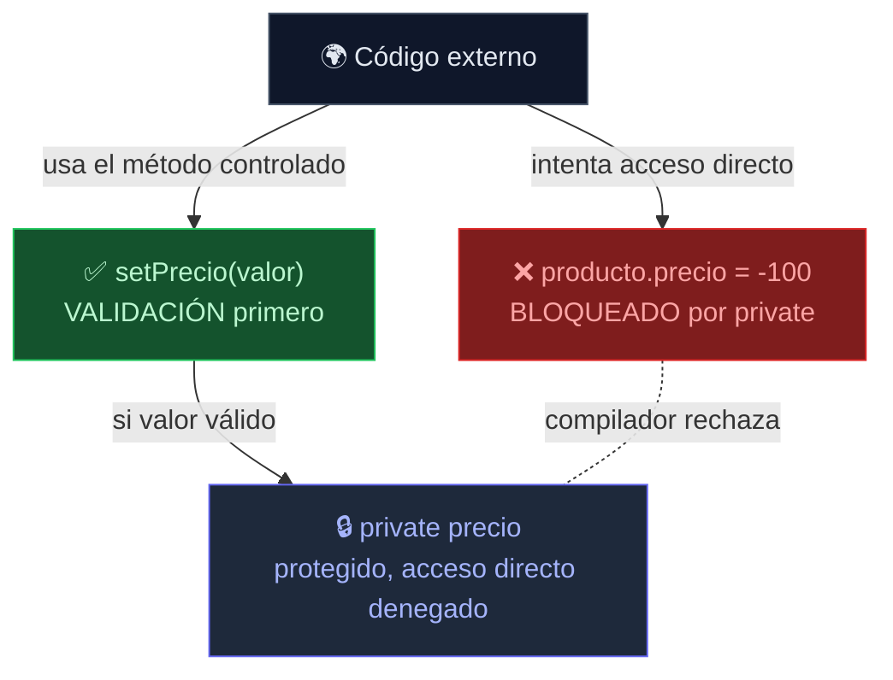
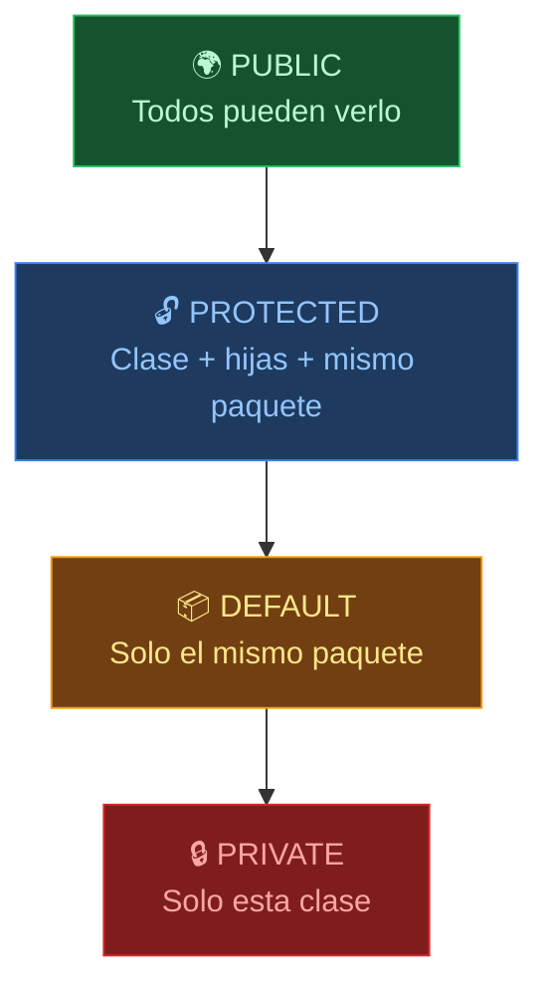
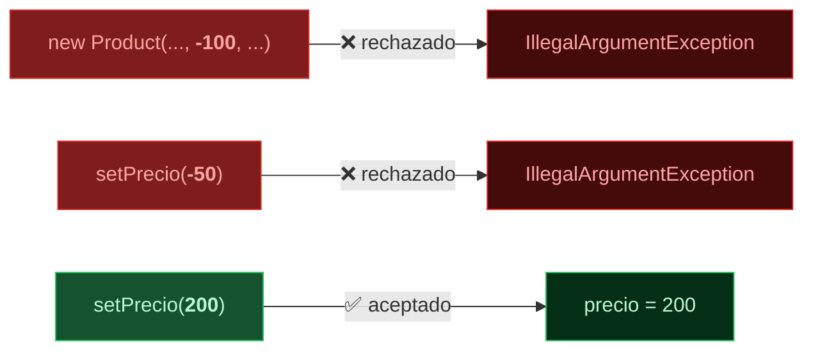

import Reveal from '../../../components/Reveal.astro';
import Quiz from '../../../components/Quiz.astro';
import SelfCheck from '../../../components/SelfCheck.astro';
import ErrorChallenge from '../../../components/ErrorChallenge.astro';
import Comparativa from '../../../components/Comparativa.astro';

## Qué vas a aprender

Después de esta lección serás capaz de declarar atributos `private`, exponerlos de forma controlada con getters y setters, y validar datos dentro del setter (o del constructor) para que un objeto nunca quede en un estado inválido.

## Por qué necesitas aprenderlo

En la lección anterior, cualquier código podía hacer `teclado.stock = -500;` directamente — un stock negativo no tiene sentido, pero Java no lo impedía. Encapsulamiento es la herramienta para que eso deje de ser posible.

## Qué debes saber antes

Clases, objetos, atributos y constructores (lección anterior de esta etapa).

## Recupera lo aprendido

¿Para qué sirve `this` dentro de un constructor?

<Reveal titulo="Respuesta">
Para referirte al atributo del objeto cuando un parámetro del constructor tiene el mismo nombre — `this.nombre` es el atributo, `nombre` (sin this) es el parámetro recibido.
</Reveal>

## Problema

Nada impedía que un código externo hiciera `producto.precio = -100.0;` o `producto.stock = -5;` directamente. Un producto con precio negativo no debería poder existir nunca — pero con atributos abiertos, cualquiera puede romper esa regla sin que el compilador se queje.

## Modelo mental



## Explicación sencilla

Encapsular significa esconder los atributos (`private`) y ofrecer únicamente métodos públicos controlados para leerlos (`getX`) o modificarlos (`setX`). El setter es el lugar exacto donde podés rechazar un valor inválido, antes de que llegue a guardarse.

## Analogía — El cajero automático

Pensá en un cajero automático:

- Vos interactuás con la PANTALLA y los BOTONES (la interfaz pública: los getters, setters, y métodos como `venderUnidades`)
- El mecanismo INTERNO — la caja fuerte, los billetes, el contador — está SELLADO (los atributos `private`)
- No podés meter la mano y sacar plata directamente (no podés hacer `cajero.billetes = -500`)
- El cajero valida CADA operación: "¿tenés saldo suficiente?" antes de entregar plata, igual que `venderUnidades` verifica `stock >= cantidad`
- Si el cajero falla, no perdés plata — simplemente la operación se rechaza

Eso es encapsulamiento: exponer QUÉ se puede hacer (métodos públicos), pero esconder CÓMO se hace por dentro (atributos privados + validaciones).

## Explicación técnica

`private` restringe el acceso a un atributo o método: solo el código dentro de la misma clase puede tocarlo directamente. Desde afuera, hace falta pasar por un método `public`.

La convención de Java para exponer un atributo `private` es:
- **Getter**: `public Tipo getNombreAtributo()` — devuelve el valor.
- **Setter**: `public void setNombreAtributo(Tipo valor)` — lo modifica, idealmente validando antes de aceptar.

Si una clase no ofrece setter para un atributo (y ese atributo es `private` y se asigna una sola vez en el constructor), el objeto es efectivamente **inmutable**: una vez creado, su estado nunca cambia. Vas a ver inmutabilidad formalizada con `record` más adelante en el curso.

El constructor también es un buen lugar para validar: si el precio inicial es inválido, ni siquiera debería poder crearse el objeto.

## Cómo funciona

1. `nombre`, `precio` y `stock` pasan de no tener modificador a `private` — ya no son accesibles como `producto.precio` desde afuera de la clase.
2. El constructor valida `precio < 0` y lanza una excepción si es inválido, ANTES de crear el objeto.
3. `setPrecio` repite esa misma validación cada vez que alguien intenta cambiar el precio después de creado el objeto.
4. `venderUnidades` valida que no se venda más stock del disponible, protegiendo la regla de negocio (no solo el tipo de dato).

## Ejemplo mínimo

**Archivo:** `proyecto/etapa-02/Product.java`

```java
public class Product {

    private String nombre;
    private double precio;
    private int stock;

    Product(String nombre, double precio, int stock) {
        if (precio < 0) {
            throw new IllegalArgumentException("El precio no puede ser negativo");
        }
        this.nombre = nombre;
        this.precio = precio;
        this.stock = stock;
    }

    public String getNombre() {
        return this.nombre;
    }

    public double getPrecio() {
        return this.precio;
    }

    public void setPrecio(double nuevoPrecio) {
        if (nuevoPrecio < 0) {
            throw new IllegalArgumentException("El precio no puede ser negativo");
        }
        this.precio = nuevoPrecio;
    }

    public int getStock() {
        return this.stock;
    }

    public void venderUnidades(int cantidad) {
        if (cantidad > this.stock) {
            throw new IllegalStateException("No hay stock suficiente");
        }
        this.stock = this.stock - cantidad;
    }

    double calcularValorInventario() {
        return this.precio * this.stock;
    }

    void describir() {
        System.out.println(this.nombre + " | precio: " + this.precio + " | stock: " + this.stock);
    }
}
```

## Predice

¿Qué creés que pasa si llamás `teclado.venderUnidades(100)` sobre un producto que solo tiene 15 unidades en stock?

<Reveal titulo="Resultado real: caso válido (compilado y ejecutado)">
```
Teclado mecanico | precio: 25000.0 | stock: 15
Nuevo precio: 27000.0
Stock despues de vender 5: 10
Valor inventario: 270000.0
```
</Reveal>

## Explicación paso a paso

- `teclado.setPrecio(27000.0)` pasa por la validación del setter antes de aceptar el nuevo precio.
- `teclado.venderUnidades(5)` descuenta 5 del stock (15 → 10) porque 5 es menor que el stock disponible.
- Ya no existe forma de hacer `teclado.precio = -100.0;` desde fuera de la clase — el compilador directamente lo rechaza, porque `precio` es `private`.

## Ejemplo aplicado al proyecto

Esta es la primera regla de negocio real protegida por código: "no se puede vender más de lo que hay en stock" ya no depende de que quien llame al método se acuerde de verificarlo antes — el objeto mismo se protege.

## Error común

<ErrorChallenge
  sintoma="Intentar vender más unidades de las que hay en stock hace que el programa se detenga con un error."
  diagnostico="El stack trace muestra: Exception in thread 'main' java.lang.IllegalStateException: No hay stock suficiente, señalando la línea exacta de venderUnidades donde se lanzó."
  causa="Se llamó venderUnidades(100) sobre un producto que solo tenía 15 unidades — el método detectó la violación de la regla de negocio y se negó a continuar."
  solucion="Verificar el stock disponible antes de intentar la venta, o (mejor) manejar formalmente esta situación con try/catch más adelante en el curso, cuando veamos excepciones en profundidad."
  prevencion="Diseñar los métodos para que validen sus propias reglas de negocio ANTES de modificar el estado, en vez de confiar en que quien los llama recuerde hacerlo."
>
```java
Product teclado = new Product("Teclado mecanico", 25000.0, 15);
teclado.venderUnidades(100); // solo hay 15 unidades
```
</ErrorChallenge>

## Ejercicio trabajado

Agregar un getter simple sin validación (porque leer nunca es peligroso, solo escribir):

```java
public String getNombre() {
    return this.nombre;
}
```

## Ejercicio guiado

Agregá un setter para `stock` que rechace valores negativos.

<Reveal titulo="Pista 1">
La firma sería `public void setStock(int nuevoStock)`.
</Reveal>

<Reveal titulo="Pista 2">
Validá `nuevoStock < 0` igual que se validó el precio, y lanzá `IllegalArgumentException` si es inválido.
</Reveal>

<Reveal titulo="Solución">
```java
public void setStock(int nuevoStock) {
    if (nuevoStock < 0) {
        throw new IllegalArgumentException("El stock no puede ser negativo");
    }
    this.stock = nuevoStock;
}
```
</Reveal>

## Ejercicio independiente

En tu clase `Customer` de la lección anterior, hacé `private` los atributos `nombre` y `email`, agregá getters, y un setter para `email` que rechace un valor vacío (`email.isEmpty()`).

## Transferencia

Si tuvieras un atributo `fechaCreacion` que debería fijarse una sola vez al crear el objeto y nunca más cambiar, ¿le agregarías un setter? ¿Qué harías en su lugar?

## Comprueba que entendiste

<Quiz
  pregunta="¿Cuál es la ventaja principal de validar en el setter, en vez de confiar en que quien llama al código verifique los datos antes?"
  opciones={[
    { texto: "El setter es más rápido de ejecutar que una validación externa", correcta: false, feedback: "No hay diferencia de performance relevante — la ventaja es de diseño y seguridad, no de velocidad." },
    { texto: "El objeto se protege a sí mismo, sin importar desde dónde se lo llame", correcta: true, feedback: "Correcto: la regla vive en un solo lugar (el setter/constructor), y se aplica siempre, sin depender de que cada llamador se acuerde de validar." },
    { texto: "Evita tener que escribir getters", correcta: false, feedback: "Getters y setters son independientes — necesitás igual un getter para poder leer el valor desde afuera." },
    { texto: "Java lo exige obligatoriamente para atributos private", correcta: false, feedback: "Java no exige ni getters ni setters para atributos private — un atributo private puede directamente no tener ninguno de los dos, si nunca necesita exponerse." },
  ]}
/>

## Mini reto de debugging

```java
public class Product {
    private double precio;

    public void setPrecio(double nuevoPrecio) {
        precio = nuevoPrecio;
    }
}
```

Este setter compila y funciona, pero un compañero de equipo lo señala en una revisión de código. ¿Qué le falta?

<Reveal titulo="Diagnóstico">
Le falta la validación. `private` protege el ACCESO al atributo, pero no valida automáticamente los valores — sigue siendo responsabilidad del código del setter rechazar un `nuevoPrecio` negativo, por ejemplo.
</Reveal>

## Mini reto de diseño

¿Por qué creés que Java no ofrece encapsulamiento "automático" (que valide solo, sin que vos escribas el `if`)? ¿Qué ventaja tiene que la validación sea código explícito tuyo?

<Comparativa
  columnas={["Concepto", "Qué protege", "Dónde se define la regla"]}
  filas={[
    ["private", "Que se acceda al atributo desde fuera de la clase", "La declaración del atributo"],
    ["Getter", "Nada — solo permite leer de forma controlada", "El método getX()"],
    ["Setter con validación", "Que el atributo tome un valor inválido", "El código dentro de setX()"],
    ["Sin setter (inmutable)", "Que el atributo cambie después de creado", "Ausencia deliberada del setter"],
  ]}
/>

## Resumen

- `private` restringe el acceso a un atributo desde fuera de la clase.
- Getters exponen lectura; setters exponen escritura, idealmente validando.
- Validar en el constructor y en el setter protege la regla de negocio en un solo lugar.
- Un objeto sin setters para sus atributos (asignados una sola vez) es efectivamente inmutable.

## Los 4 niveles de visibilidad



| Modificador | Clase misma | Mismo paquete | Subclase (hija) | Cualquiera |
|-------------|:-----------:|:-------------:|:---------------:|:----------:|
| `private`   | ✅ | ❌ | ❌ | ❌ |
| (default)   | ✅ | ✅ | ❌ | ❌ |
| `protected` | ✅ | ✅ | ✅ | ❌ |
| `public`    | ✅ | ✅ | ✅ | ✅ |

Por ahora usá `private` para atributos (protección máxima) y `public` para métodos que querés exponer. `protected` lo vas a necesitar cuando veas herencia (próxima lección).

## Invariantes de clase — el contrato invisible



## Ley de Demeter — no hables con extraños

También conocido como "principio de menor conocimiento": un método solo debería hablar con:
- Sus propios atributos (`this`)
- Sus parámetros
- Objetos que él mismo creó

**No hagas esto:**
```java
// mal: encadenamiento de llamadas — "train wreck"
orden.getCliente().getDireccion().getCiudad();
```

**Hacé esto:**
```java
// bien: pedile al objeto que haga su trabajo, no le saquees sus tripas
orden.obtenerCiudadDeEnvio();
```

Cada clase debería conocer lo mínimo indispensable sobre las demás. Vas a profundizar esto con la D de SOLID (Dependency Inversion) en la Etapa 7.

## Modelo mental final

Cuando pienses en encapsulamiento, imaginá una caja fuerte con una ranura de depósito: podés meter algo (setter), pero la ranura revisa que lo que metés sea válido antes de aceptarlo — no podés simplemente abrir la caja y cambiar lo que hay adentro a mano.

## Conexión

Los mismos atributos y constructor de la lección anterior ahora están protegidos — el comportamiento externo (`describir()`, `calcularValorInventario()`) no cambió en nada.

## Próximo paso

Etapa 2 / Lección 3: herencia y composición.

## Fuentes

dev.java — sección de encapsulamiento y modificadores de acceso. openjdk.org — especificación del lenguaje Java (JLS), modificador private.

<SelfCheck
  leccionId="etapa-02-poo/leccion-02-encapsulamiento"
  criterios={[
    "Puedo hacer private un atributo y exponerlo con getters/setters.",
    "Puedo validar datos dentro de un setter o constructor antes de aceptarlos.",
    "Puedo explicar cómo lograr un objeto efectivamente inmutable (sin setters).",
    "Entiendo que private protege el acceso, pero la validación de valores es responsabilidad mía.",
  ]}
/>
